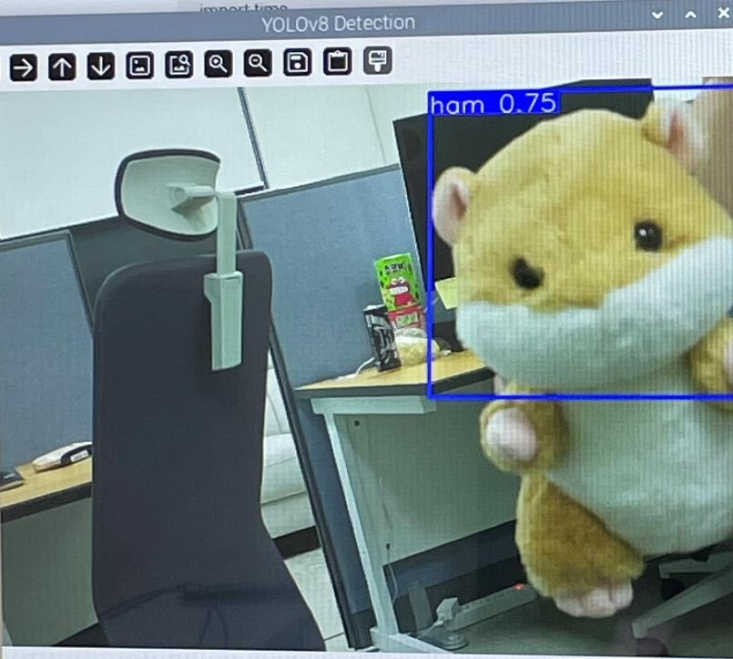
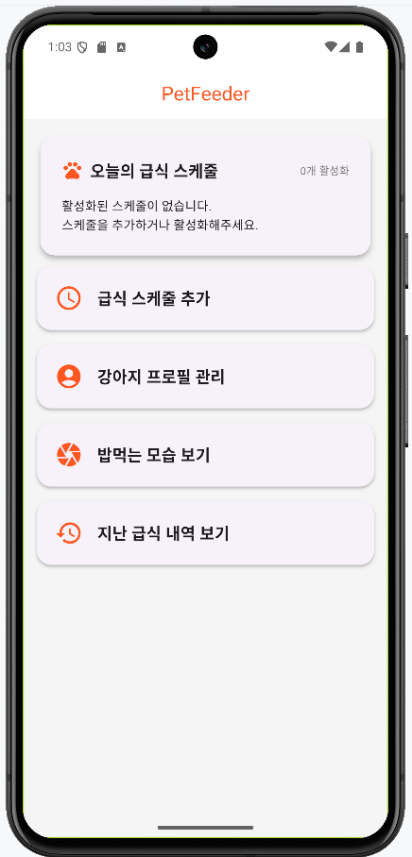
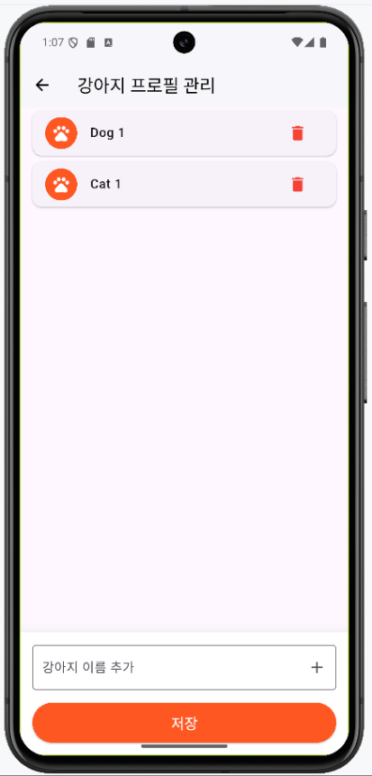
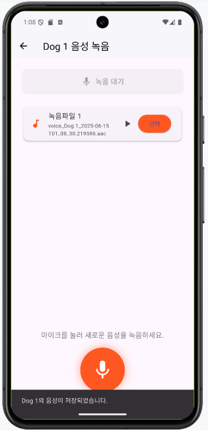
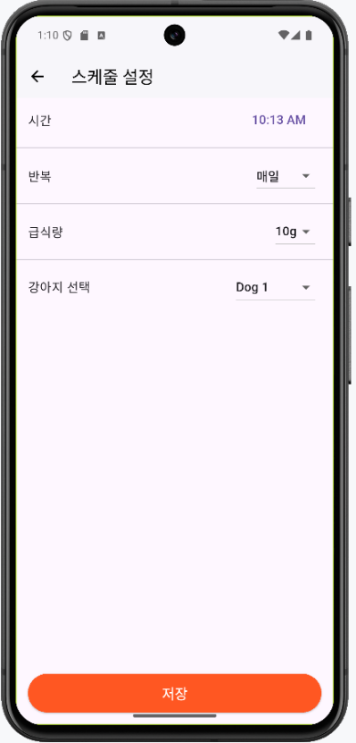
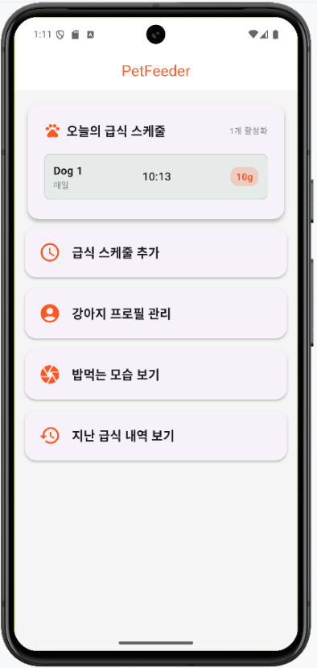
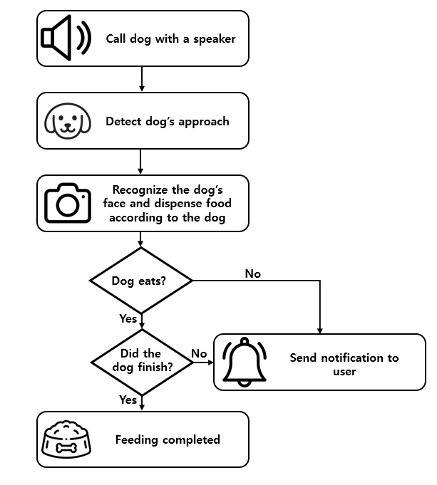

# 🐶 Smart PetFeeder (SmaPF)
 

본 프로젝트는 반려견의 얼굴을 인식하여 개체별 맞춤 급식량을 자동으로 배분하고, 섭취 여부 및 잔반 유무를 판단하여 사용자에게 알림을 전송하는 **스마트 급식 시스템**입니다.

---

## 📌 주요 기능

1. **강아지 접근 감지**  
   - 스피커를 통해 사용자 음성 녹음 재생
   - 초음파 센서로 반려견 접근 여부 실시간 감지  
   - 감지 시 카메라 자동 활성화

2. **강아지 얼굴 인식 및 분류**  
   - YOLO 기반 실시간 얼굴 인식  
   - 학습된 YOLO 모델로 품종 분류
   
3. **정량 급식 제어**  
   - SG90 서보모터를 사용한 각도 제어로 정밀한 사료 배출  
   - HX711 로드셀 센서를 통해 실시간 사료 중량 측정

4. **섭취 여부 및 잔반 판단**  
   - 일정 시간 후 사료 무게 변화 감지  
   - 변화 없을 시 '섭취 안 함', 일부만 줄어들면 '잔반 발생' 판단

5. **사용자 스마트폰 연동**  
   - 사용자 음성 녹음
   - 강아지 등록페이지를 통해 강아지별 급식 시간, 급식 양 설정, 출력할 음성녹음 선택
   - 실시간 보기를 통해 강아지 감시
   - 급식 내역을 통해 섭취 여부, 잔반 여부, 급식 시간 확인
   

   

   

   

   

  
---

## 🛠️ 사용 부품 및 장비

- **라즈베리파이 5**
- **초음파 센서**
- **카메라 모듈**
- **SG90 서보모터**
- **HX711 + 로드셀**
- **스피커**
- **앱 연동**

---

## 📷 시스템 구성 

## 💡 개발 목표

- **스마트 IoT 기술**을 이용한 실시간 급식 제어
- **AI 기반 분류 및 자동화**
- **사용자 친화적 피드백 시스템 구축**

---

## 📲 향후 확장 아이디어

- 반려견 활동량 기반 사료량 조절
- 다중 반려견 관리 시스템
- 클라우드 기반 급식 로그 통계 제공

---

## 👨‍💻 팀 소개

- 김도익 (AI 모델링 & 시스템 통합 & 앱 연동)
- 김민중 (AI 모델링 & 앱 연동)
- 서범석 (앱 연동 & 사용자 피드백 시스템)